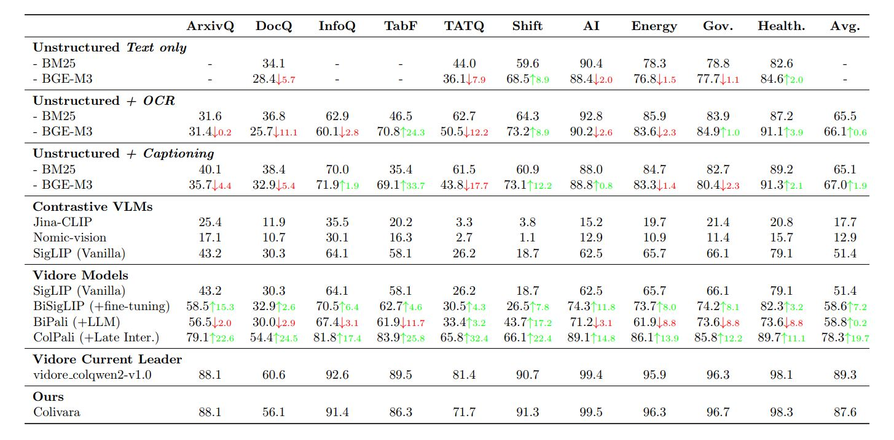

# Colivara Evaluation Project



This repository contains a comprehensive evaluation of the [Colivara](https://github.com/tjmlabs/ColiVara) API for document management, search, and retrieval, using a Retrieval-Augmented Generation (RAG) model. This evaluation aims to assess Colivara's capabilities in managing document collections, performing efficient search operations, and calculating relevance metrics to measure performance.

| Benchmark              | Colivara   | vidore_colqwen2-v1.0 (Current Leader) | vidore_colpali-v1.3 | vidore_colpali |
|------------------------|------------|----------------------|---------------------|----------------|
| Average                | 87.6       ↓ | 89.3                 | 84.8                | 81.3           |
| Tat DQA                | 71.7       ↓ | 81.4                 | 70.4                | 65.8           |
| Shift Project          | 91.3       ↑ | 90.7                 | 77.4                | 73.2           |
| Artificial Intelligence| 99.5       ↑ | 99.4                 | 97.4                | 96.2           |
| Government Reports     | 96.7       ↑ | 96.3                 | 96.2                | 92.7           |
| ArxivQA                | 88.1       ↑ | 88.1                 | 83.0                | 79.1           |
| DocVQA                 | 56.1       ↓ | 60.6                 | 58.5                | 54.4           |
| Healthcare Industry    | 98.3       ↑ | 98.1                 | 96.9                | 94.4           |
| InfoVQA                | 91.4       ↓ | 92.6                 | 85.7                | 81.8           |
| Energy                 | 96.3       ↑ | 95.9                 | 95.4                | 91.0           |
| TabFQuad               | 86.3       ↓ | 89.5                 | 87.4                | 83.9           |


## Table of Contents
- [Project Overview](#project-overview)
- [Evaluation Results](#evaluation-results)
- [Features](#features)
- [Requirements](#requirements)
- [Installation](#installation)
- [Usage](#usage)
  - [Document Upsert with `main.py`](#document-upsert-with-mainpy)
  - [Relevance Evaluation with `evaluate.py`](#relevance-evaluation-with-evaluatepy)
  - [Collection Management with `collection_manager.py`](#collection-management-with-collection_managerpy)
- [File Structure](#file-structure)
- [Configuration](#configuration)
- [Technical Details](#technical-details)
- [Future Enhancements](#future-enhancements)
- [License](#license)

---

## Project Overview

The goal of this project is to evaluate Colivara’s document retrieval and management features, particularly for applications that rely on high-performance data search and retrieval. This includes testing Colivara's collection and document management, assessing its suitability for various search and retrieval scenarios, and benchmarking the platform with a RAG model to evaluate relevance based on real-world queries.

## Evaluation Results

Below are the summarized evaluation results for the Colivara API performance based on NDCG metrics:

| Benchmark              | Colivara Score | Avg Latency (s) | Num Docs |
|------------------------|----------|-------------|----------|
| Average                | 87.6     | ----         | ----      |
| ArxivQA                | 88.1     | 11.1        | 500      |
| DocVQA                 | 56.1     | 9.3         | 500      |
| InfoVQA                | 91.4     | 8.6         | 500      |
| Shift Project          | 91.3     | 16.8        | 1000     |
| Artificial Intelligence| 99.5     | 12.8        | 1000     |
| Energy                 | 96.3     | 14.1        | 1000     |
| Government Reports     | 96.7     | 14.0        | 1000     |
| Healthcare Industry    | 98.3     | 20.0        | 1000     |
| TabFQuad               | 86.3     | 8.1         | 280      |
| TatQA                  | 71.7     | 20.0        | 1663     |


## Features

- **Data Loading**: Load document datasets in a structured format for evaluation, with support for processing metadata and converting images to base64.
- **Document Management**: Manage collections and documents, including creation, updating, and deletion.
- **RAG Model Evaluation**: Use NDCG (Normalized Discounted Cumulative Gain) to evaluate the relevance of search results.
- **Collection Management Tool**: A utility for listing, creating, and deleting collections in Colivara.
- **Comprehensive Configurations**: Load configurations from environment variables for easy setup and deployment.

## Requirements

- Python 3.10+
- Colivara API (configured and accessible) either self-hosted locally or using the hosted version.
- [colivara-py](https://github.com/tjmlabs/colivara-py) Python client


## Installation

1. **Clone the repository:**
   ```bash
   git clone https://github.com/tjmlabs/colivara-eval.git
   cd colivara-eval
   ```

2. **Install the dependencies:**
   ```bash
   uv venv
   source venv/bin/activate
   uv sync
   ```

3. **Configure Environment Variables:**
   - Create a `.env` file in the root directory.
   - Add the following variables:
     ```bash
     COLIVARA_API_KEY=your_api_key_here
     COLIVARA_BASE_URL=https://api.colivara.com
     ```


4. **Download the Dataset:**
   - Download the dataset file(s) for evaluation.
   - Run the following command:
   ```bash
   python src/download_datasets.py
   ```

## Usage

The Colivara Evaluation Project provides a streamlined interface for managing and evaluating document collections within Colivara. The primary entry points for usage are `main.py` for performing document upsert operations and `evaluate.py` for relevance evaluation.

### Document Upsert with `main.py`

The `main.py` script enables you to upsert documents into Colivara collections. It allows selective processing of single datasets or batch processing across all available datasets, making it adaptable for various scenarios.

#### Key Arguments

- **`--n_rows`**: Specify the number of rows to load from the dataset for processing. This is optional; if not provided, the script will load all rows.
- **`--upsert`**: Include this flag if you want to upsert documents into Colivara.
- **`--all_files`**: Processes all datasets in the `DOCUMENT_FILES` list.
- **`--specific_file`**: Specify a single file to process by name (must match one of the files in `DOCUMENT_FILES`).
- **`--collection_name`**: Use this to define a custom collection name when processing a specific file. If not provided, the script defaults to the predefined collection name for that file.

### Example Commands

#### 1. Upserting a Single Dataset

To upsert documents from a specific dataset, run:
```bash
python main.py --specific_file arxivqa_test_subsampled.pkl --collection_name arxivqa_collection --upsert
```

This command will upsert all documents from `arxivqa_test_subsampled.pkl` into `arxivqa_collection` if it doesn’t already exist.

#### 2. Upserting All Datasets

To upsert documents for all datasets:
```bash
python main.py --all_files --upsert
```

This command will loop through all datasets in `DOCUMENT_FILES`, upserting documents into their corresponding collections.

### Relevance Evaluation with `evaluate.py`

The `evaluate.py` script is used to evaluate the relevance of document collections within Colivara.

#### Key Arguments

- **`--collection_name`**: Specify the collection name to evaluate.
- **`--all_files`**: Evaluate all collections listed in `DOCUMENT_FILES`.

### Example Commands

#### 1. Evaluating a Single Collection

To evaluate the relevance of a specific collection, run:
```bash
python evaluate.py  --collection_name arxivqa_collection
```

This command will evaluate the specified collection and output the relevance metrics based on NDCG@5.

#### 2. Evaluating All Collections

To evaluate the relevance of all collections:
```bash
python evaluate.py --all_files
```

This command will perform a relevance evaluation (NDCG@5) on all datasets listed in `DOCUMENT_FILES` and save the results in the `out/` directory:
- **`out/avg_ndcg_scores.pkl`** – Contains the average NDCG@5 score for each dataset.
- **`out/ndcg_scores.pkl`** – Provides detailed NDCG scores for each query.
- **`out/<collection_name>_ndcg_scores.pkl`** – Provides detailed NDCG scores for each query in the specified collection.

### Collection Management with `collection_manager.py`

The `collection_manager.py` script provides utilities for listing and deleting collections within Colivara.

#### Commands

- **List All Collections**
  ```bash
  python collection_manager.py --list
  ```
  Displays all existing collections within Colivara.

- **Delete a Collection**
  ```bash
  python collection_manager.py --delete <collection_name>
  ```
  Deletes the specified collection. This action is irreversible, so ensure that the correct collection name is provided.

## File Structure

- `src/`
  - `client.py`: Initializes the Colivara client.
  - `data_loader.py`: Handles data loading and base64 image encoding.
  - `document_manager.py`: Manages document upserting and collection creation.
  - `evaluator.py`: Evaluates model performance using NDCG.
- `collection_manager.py`: Provides collection listing and deletion tools.
- `main.py`: Main script for document upsertion and evaluation.
- `tests/`: Contains unit tests for the project.
- `data/`: Stores the dataset for evaluation.
- `.env`: Environment configuration file (not included in version control).
- `requirements.txt`: Lists Python package dependencies.

## Configuration

The project configuration relies on environment variables defined in a `.env` file:
- `COLIVARA_API_KEY`: API key for authenticating with the Colivara service.
- `COLIVARA_BASE_URL`: The base URL for accessing Colivara's API.

Use `dotenv` to load these configurations automatically, ensuring that sensitive information is securely managed.

## Technical Details

### Discounted Cumulative Gain (DCG)

DCG is a measure of relevance that considers the position of relevant results in the returned list. It assigns higher scores to results that appear earlier.

### Normalized Discounted Cumulative Gain (NDCG)

NDCG normalizes DCG by dividing it by the ideal DCG (IDCG) for a given query, providing a score between 0 and 1. In this project, we calculate NDCG@5 to evaluate the top 5 search results for each query.

### Search Query Evaluation

The evaluation process includes:
1. **Query Processing**: Matching queries against document metadata.
2. **Relevance Scoring**: Using true document IDs to calculate relevance scores.
3. **NDCG Calculation**: Aggregating scores to calculate the average relevance.

## Future Enhancements

1. **Parallel Processing**: Optimize data loading and evaluation functions for concurrent processing.
2. **Extended Metrics**: Add other evaluation metrics like Mean Reciprocal Rank (MRR).
3. **Benchmarking with Larger Datasets**: Test Colivara's scalability with larger data volumes.
4. **Automated Testing**: Integrate unit and integration tests for CI/CD compatibility.

## License

This project is licensed under the MIT License - see the [LICENSE](LICENSE) file for details.
